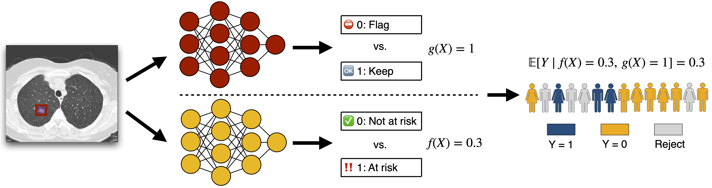

# Calibrated Selective Classification

This code provides an implementation of [Calibrated Selective Classification](https://openreview.net/forum?id=zFhNBs8GaV).

## Summary

<p align="center"></p>

Selective classification allows models to abstain from making predictions (e.g., say "I don't know") when in doubt in order to obtain better effective accuracy. While typical selective models can succeed at producing more accurate predictions on average, they may still allow for wrong predictions that have high confidence, or skip correct predictions that have low confidence. Providing *calibrated* uncertainty estimates alongside predictions---probabilities that correspond to true frequencies---can be as important as having predictions that are simply accurate on average. Uncertainty estimates, however, can sometimes be unreliable. This repository implements a new approach to calibrated selective classification (CSC), where a selector is learned to reject examples with "uncertain" uncertainties. The goal is to make predictions with well-calibrated uncertainty estimates over the distribution of accepted examples, a property called selective calibration.

## Setup

We provide instructions to install CSC within a [conda](https://conda.io/projects/conda/en/latest/user-guide/tasks/manage-environments.html) environment running Python 3.8. 

```
conda create -n csc python=3.8 && conda activate csc
```

Install PyTorch following the instructions from pytorch.org.

Install all other requirements via `pip install -r requirements.txt`.

All commands should now be run from the root directory of this repository.


## Pre-trained models
All pre-trained $f(X)$ and $g(X)$ models used in our experiments (for CIFAR-10, ImageNet, and Lung) can be downloaded by running:
```
./download_models.sh
```

Similarly, all pre-processed data (with the exception of lung cancer data, which we cannot directly release) can be downloaded by running:
```
./download_data.sh
```
See individual repositories for instructions on task-specific training, data downloading, and preprocessing.

## Data

> **Note**
> The following steps assume that training and testing data have already been preprocessed into [InputDataset](src/data/__init__.py)'s, and that the calibration and validation data have been processed into [BatchedInputdataset](src/data/__init__.py)'s. This format is described below.

### Input formats

An `InputDataset` is a namedtuple with the following fields:
- `input_features`: The representation for the input $x$. For example, the last layer representation of $f(x)$ derived for all inputs $x$ in the dataset.
This is an array of size `[num_examples, num_features]`.
- `output_probs`: The prediction $p_\theta(y|x)$. This is an array of size `[num_examples, num_classes]` (for binary problems, take `num_classes` = 2).
- `confidences`: The confidence estimate (typically $p_\theta(y = 1 | x)$ for binary problems, or $\max p_\theta(y | x)$ for multi-class problems). This is an array of size `[num_examples]`.
- `labels`: The binary (or binarized) label (typically $y$ for binary problems, or $y = \arg\max p_\theta(y | x)$ for multi-class problems). This is an array of size `[num_examples]`.

A `BatchedInputDataset` is exactly the same as the above `InputDataset`, with the difference that each portion of the data has an extra leading dimension for the perturbation index. Specifically, the calibration and validation data are comprised of *perturbed* batches of data, in which a perturbation $t \in \mathcal{T}$ has been applied to a batch of training data from $\mathcal{D}_\text{train}$. The `BatchedInputDataset` is therefore essentially a concatenation of many `InputDataset`s. The sizes of each field of a `BatchedInputDataset` are therefore:
- `input_features`: `[num_perturbations, num_examples_per_perturbation, num_features]`.
- `output_probs`: `[num_perturbations, num_examples_per_perturbation, num_classes]`.
- `confidences`: `[num_perturbations, num_examples_per_perturbation]`.
- `labels`: `[num_perturbations, num_examples_per_perturbation]`.

### Checking the calibration error

Running these scripts is optional, and only for exploring the data. 

To check the initial calibration error without any selection, you can run:
```
python bin/tools/check_calibration_error.py \
  --dataset <path to saved InputDatast or BatchedInputDataset>
```

Similarly, if interested in estimating the "ideal" calibration error at a particular coverage level, you can run:
```
python bin/tools/estimate_ideal_error.py \
  --dataset <path to saved InputDatast or BatchedInputDataset> \
  --coverage <coverage level>
```

> **Warning** This directly optimizes binary weights for each example in the provided datase to minimize the S-MMCE. It does not represent generalization error, and is only useful for estimating an upper bound on performance.

### Generating features
To generate the meta-features, run
```
python bin/tools/generate_meta_features.py \
  --train-dataset <path to saved InputDataset> \
  --cal-dataset <path to saved BatchedInputDataset> \
  --val-dataset <path to saved BatchedInputDataset> \
  --test-datasets <paths to saved InputDatasets>
```

This will save the calibration, validation, and each testing file as a new `InputDataset` (or `BatchedInputDataset`), with the `input_features` field replaced with the derived meta features. 

> **Note** See section 4.5 of the paper for a description of the chosen meta features.

## Training a selective model

To train a *soft* selective model $\tilde{g}(X)$ (implemented as a [SelectiveNet](src/models.py)), run:
```
python bin/tools/train_selective_model.py \
  --cal_dataset <path to saved BatchedInputDataset> \
  --val_dataset <path to saved BatchedInputDataset>
```
The binary predictor $g(X) := 1 \[ \tilde{g}(X) \geq \tau \]$ is derived by calibrating a threshold for this soft predictor.


> **Note** All of the subsequent evaluation steps simultaneously calibrate and evaluate the selector `g(X)` such that it acheives the target coverage. To derive a threshold for the soft selector, run 
> ```
> python bin/tools/evaluate_selector_threshold.py \
>   --model_file <path to save SelectiveNet checkpoint> \
>   --calibration_dataset <path to saved (unlabeled) InputDataset>
> ```
  
  
To make predictions (at a target coverage level) on a new dataset, run:
```
python bin/tools/run_selective_model.py \
  --model_file <path to saved SelectiveNet checkpoint> \
  --input_dataset <path to saved InputDataset> \
  --coverage_level <coverage level> \
  --output_file <path to output file>
```
If the coverage level is $\leq 0$, then the above command will output soft scores $\tilde{g}(X)$ that are not yet binarized.

To evaluate the selective predictor in terms of selective calibration error, run:
```
python bin/tools/evaluate_selective_model.py \
  --model_file <path to saved SelectiveNet checkpoint> \
  --input_datasets <path to saved InputDatasets> \
  --coverage_level <coverage level> \
  --output_file <path to output file>
```
If the coverage level is $\leq 0$, then the above command will compute the selective calibration error AUC.


## Visualizing predictions

We provide some Jupyter notebook scripts for visualizing predictions in the [notebooks](notebooks) folder.

## Citation
If you find this work useful, please cite our TMLR paper:
```
@article{fisch2022selective,
    title={Calibrated Selective Classification},
    author={Adam Fisch and Tommi Jaakkola and Regina Barzilay},
    journal={Transactions on Machine Learning Research (TMLR)},
    month={Nov},
    year={2022},
    url={https://openreview.net/forum?id=zFhNBs8GaV},
}
```
